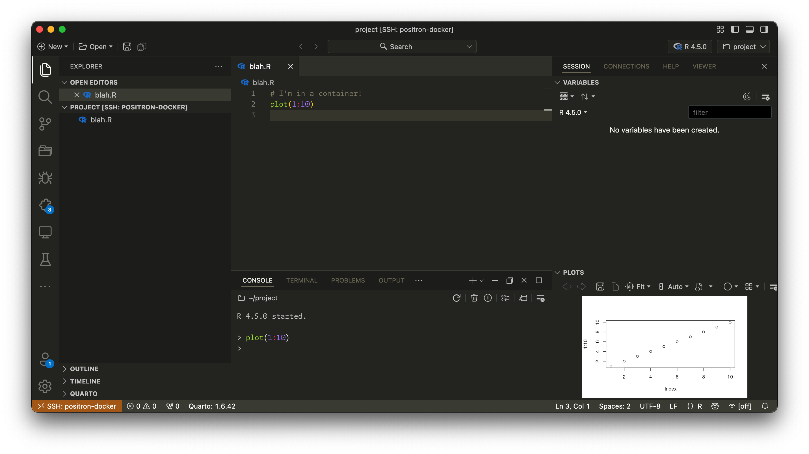

[**See this blog post for more details about why this approach is helpful.**](https://www.andrewheiss.com/blog/2025/07/05/positron-ssh-docker/)

1. Build Docker Compose services:

   ```sh
   docker compose -f docker-compose.yml up -d
   ```

2. Make sure you have a public SSH key saved in `~/.ssh` on your computer

3. The R container has an SSH server exposed at port 2222. You can connect to it from the terminal on your computer with:

   ```sh
   ssh rstudio@localhost -p 2222
   ```

   Or you can set up a saved connection (which Positron will be able to read) by adding this entry to `~/.ssh/config`:

   ```default
   Host positron-docker
       HostName localhost
       User rstudio
       Port 2222
   ```

   With that, you can connect like this from the terminal:

   ```sh
   ssh positron-docker
   ```

   Or you can use Positron's Remote Explorer panel

It works!


